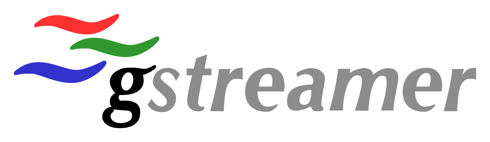
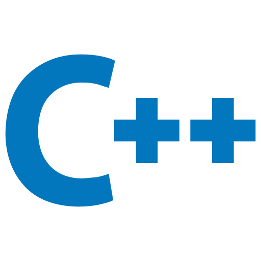

# GStreamer Learning - Hands-On Learning with the Multimedia Framework

**[English](README.md) | [Turkce](README_tr.md)**

<div align="center">
  
  &nbsp;&nbsp;&nbsp;
  
</div>

<div align="center">

**Projects from basics to advanced with GStreamer multimedia framework in C/C++ and Python**


</div>

---

## About

This repo contains projects developed during my learning journey with the GStreamer multimedia framework. Starting from simple Python/C examples, it includes 11 projects spanning up to stereo depth estimation and GPU-accelerated object detection.

> **Note:** The [GSt_Note_en.md](GSt_Note_en.md) file serves as **English learning notes** about GStreamer (Turkish version: [GSt_Note_tr.md](GSt_Note_tr.md)). It contains explanations of core concepts such as pipeline, element, pad, and bus. The project source codes should be evaluated separately in the folders listed below.

---

## Projects

| # | Project | Description | Language | Key Technologies |
|---|---------|-------------|----------|------------------|
| **00** | [First Code](00.first_code/) | GStreamer introduction - First pipeline with Python | Python | PyGObject, GLib |
| **01** | [Basic Tutorial](01.basic_tutorial/) | 7 basic C tutorials (playback, bus, seek, state) | C | GStreamer C API |
| **02** | [Media Player](02.media_player/) | Interactive command-line media player | C++ | Multithreading, GStreamer C++ wrapper |
| **03** | [Video Converter](03.video_converter/) | GPU-accelerated video format converter | C++ | CUDA, NVENC, x264, VP8 |
| **04** | [Optical Flow](04.Optical_flow_with_GST/) | Real-time motion detection with optical flow | C++ | OpenCV, Lucas-Kanade, Harris Corner |
| **05** | [RTSP Server/Client](05.RTSP_server_client/) | Low-latency RTSP streaming system (<250ms) | C++ | RTSP/RTP, x264 zerolatency |
| **06** | [DeepDetect Plugin](06.Gstreamer_DeepDetect_Plugin_Project/) | YOLOv8 + TensorRT object detection plugin | C++ | TensorRT, CUDA, FP16/INT8 |
| **07** | [Video Analytics Pipeline](07.GStreamer_Video_Analytics_Pipeline/) | Modular video analytics framework | C++ | OpenCV, NVENC/NVDEC, YAML config |
| **08** | [Video Mosaic Creator](08.video_mosaic_creator/) | Multi-source video mosaic combiner (2-16 sources) | C++ | GStreamer Compositor, YAML-CPP |
| **09** | [Video Frame Extractor](09.video_frame_extractor/) | Smart frame extraction tool (interval, keyframe, time-based) | C++ | OpenCV, appsink |
| **10** | [Stereo Depth Pipeline](10.stereo_depth_pipeline/) | Depth estimation and obstacle detection with stereo vision | C++ | StereoBM/SGBM, OpenCV, V4L2 |

---

## Learning Roadmap

```
Beginner                       Intermediate                    Advanced
────────                       ────────────                    ────────
00. Python Init          ──>   03. Video Converter (GPU)     ──>  06. DeepDetect Plugin (TensorRT)
01. C Tutorials (x7)     ──>   04. Optical Flow (OpenCV)     ──>  07. Video Analytics Framework
02. Media Player (C++)   ──>   05. RTSP Streaming            ──>  08. Video Mosaic (Multi-source)
                               09. Frame Extractor           ──>  10. Stereo Depth (Robotics)
```

---

## Prerequisites

### Required
```bash
# GStreamer development libraries
sudo apt install -y \
  libgstreamer1.0-dev \
  libgstreamer-plugins-base1.0-dev \
  gstreamer1.0-plugins-good \
  gstreamer1.0-plugins-bad \
  gstreamer1.0-plugins-ugly \
  gstreamer1.0-tools

# CMake and build tools
sudo apt install -y cmake build-essential pkg-config
```

### Additional Dependencies by Project

| Dependency | Used in Projects | Installation |
|------------|-----------------|--------------|
| OpenCV | 04, 07, 09, 10 | `sudo apt install libopencv-dev` |
| YAML-CPP | 07, 08, 09 | `sudo apt install libyaml-cpp-dev` |
| GStreamer RTSP Server | 05, 07 | `sudo apt install libgstrtspserver-1.0-dev` |
| CUDA + TensorRT | 03, 06 | NVIDIA official installation guide |
| V4L2 | 04, 10 | `sudo apt install v4l-utils` |

---

## Quick Start

### Basic Tutorials (Project 01)
```bash
cd 01.basic_tutorial
gcc basic-tutorial-1.c -o basic-tutorial-1 `pkg-config --cflags --libs gstreamer-1.0`
./basic-tutorial-1
```

### Building CMake Projects (Project 02-10)
```bash
cd 02.media_player    # or any CMake project
mkdir -p build && cd build
cmake ..
make -j$(nproc)
```

---

## Project Details

### 00 - First Code (Python)
Getting started with GStreamer using Python and setting up the GLib MainLoop. The first step to understanding how the framework operates.

### 01 - Basic Tutorial (C)
7 examples based on GStreamer's official tutorial series:
- **Tutorial 1-2:** Creating pipelines, media playback with playbin
- **Tutorial 3-4:** Bus messages, error handling, seek operations
- **Tutorial 5-7:** Caps negotiation, dynamic elements, playback rate control

### 02 - Media Player (C++)
Full-featured interactive media player:
- Play/Pause/Stop controls
- Fast forward/rewind (+-10 seconds)
- Media info display (duration, codec, bitrate)
- Real-time position updates on a separate thread

### 03 - Video Converter (C++)
NVIDIA GPU-accelerated video format converter (MP4, WebM, AVI). Automatically falls back to CPU encoder if no GPU is found. Supports CUDA 12.4 and RTX series.

### 04 - Optical Flow (C++)
Real-time motion detection from webcam or video file:
- Feature point detection with Harris corner detection
- Lucas-Kanade optical flow algorithm
- Visualization of motion vectors

### 05 - RTSP Server/Client (C++)
Low-latency (<250ms) RTSP streaming system:
- **Server:** Camera -> H.264 encode -> RTSP/RTP stream
- **Client:** Stream receiving, decoding, latency measurement and reporting
- `tune=zerolatency`, `speed-preset=ultrafast` optimizations

### 06 - DeepDetect Plugin (C++)
Production-quality GStreamer plugin:
- Real-time object detection with YOLOv8 model
- TensorRT FP16/INT8 quantized inference
- Zero-copy GPU memory operations
- JSON metadata output
- ~245 FPS with YOLOv8n on RTX 4090

### 07 - Video Analytics Pipeline (C++)
Modular video analytics framework:
- File, webcam, RTSP, HTTP input sources
- OpenCV-based motion detection
- NVENC/NVDEC GPU acceleration
- YAML-based pipeline configuration
- Runtime dynamic pipeline modification

### 08 - Video Mosaic Creator (C++)
Mosaic system combining 2-16 sources on a single screen:
- Flexible grid layouts (2x2, 3x3, 4x4, custom)
- Automatic reconnection for RTSP streams
- Source and layout configuration via YAML

### 09 - Video Frame Extractor (C++)
Smart frame extraction from video:
- **interval:** Every N frames
- **keyframe:** I-frames only
- **time_based:** Time-interval based (e.g., every 5 seconds)
- PNG/JPEG/BMP output formats
- Optional resizing and timestamps

### 10 - Stereo Depth Pipeline (C++)
Stereo vision system for robotics applications:
- Dual camera or simulation mode
- Disparity computation with StereoBM/StereoSGBM
- Metric depth map (Z = focal x baseline / disparity)
- 3x4 grid obstacle detection (SAFE/CAUTION/DANGER)
- 4-panel real-time visualization
- ROS2 integration example

---

## Project Structure

```
Gstreamer-Learning/
├── 00.first_code/                  # Python introduction
├── 01.basic_tutorial/              # C fundamentals (7 tutorials)
├── 02.media_player/                # C++ media player
│   ├── include/                    # Header files
│   ├── src/                        # Source code
│   └── CMakeLists.txt
├── 03.video_converter/             # GPU-accelerated converter
├── 04.Optical_flow_with_GST/       # Optical flow
├── 05.RTSP_server_client/          # RTSP streaming
├── 06.Gstreamer_DeepDetect_Plugin_Project/  # YOLOv8 plugin
│   ├── src/
│   ├── include/
│   ├── tests/
│   ├── scripts/
│   └── docs/
├── 07.GStreamer_Video_Analytics_Pipeline/    # Video analytics
├── 08.video_mosaic_creator/        # Mosaic combiner
├── 09.video_frame_extractor/       # Frame extractor
├── 10.stereo_depth_pipeline/       # Stereo depth
├── data/                           # Logos and images
├── GSt_Note_en.md                  # GStreamer English learning notes
├── GSt_Note_tr.md                  # GStreamer Turkish learning notes
├── LICENSE                         # Apache 2.0
└── .gitignore
```

---

## Technologies Used

- **Multimedia:** GStreamer 1.0, RTSP/RTP, H.264/VP8/MPEG-4
- **Computer Vision:** OpenCV (optical flow, stereo matching, motion detection)
- **GPU Acceleration:** NVIDIA CUDA 12.4, TensorRT 10.0, NVENC/NVDEC
- **Artificial Intelligence:** YOLOv8 (object detection), FP16/INT8 quantization
- **Build:** CMake, pkg-config, Meson
- **Languages:** C++17, C, Python 3

---

## License

This project is licensed under the [Apache License 2.0](LICENSE).
